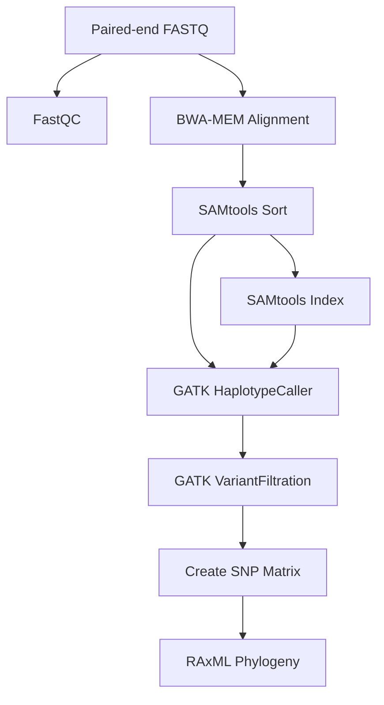

# Variant Calling and Phylogenetic Analysis Pipeline

A Nextflow DSL2 pipeline for variant calling from Illumina paired-end reads and phylogenetic tree construction.

## Pipeline Overview

This pipeline performs:

1. **Quality Control** - FastQC v0.11.5
2. **Read Alignment** - BWA-MEM v0.7.8 to reference genome
3. **BAM Processing** - SAMtools v1.3.1 sorting and indexing
4. **Variant Calling** - GATK HaplotypeCaller v4.0
5. **Variant Filtering** - Custom filtering with specified parameters
6. **SNP Matrix Creation** - Presence/absence matrix relative to reference
7. **Phylogenetic Analysis** - RAxML v8.2.9 with 1000 bootstrap replicates

## Quick Start

### Prerequisites

- Nextflow >= 23.04.0
- Docker, Singularity, or Conda (for dependency management)

### Installation

```bash
# Clone or download this pipeline
git clone <repository_url>
cd variant-calling-phylogeny

# Test the pipeline
nextflow run main.nf -profile test,docker
```

### Running the Pipeline

#### Basic usage

```bash
nextflow run main.nf \
    --input samplesheet.csv \
    --reference reference/Af293.fasta \
    --reference_fai reference/Af293.fasta.fai \
    --reference_dict reference/Af293.dict \
    --repeat_mask reference/Af293_repeats.bed \
    --outdir results \
    -profile docker
```

#### With custom filtering parameters

```bash
nextflow run main.nf \
    --input samplesheet.csv \
    --reference reference/Af293.fasta \
    --min_depth 15 \
    --min_mapping_quality 50.0 \
    --min_qual_by_depth 3.0 \
    --max_fisher_strand 50.0 \
    --min_genotype_quality 60 \
    --outdir results \
    -profile docker
```

## Input Files

### Sample Sheet

Create a CSV file with the following format:

```csv
sample_id,read1,read2
sample1,data/sample1_R1.fastq.gz,data/sample1_R2.fastq.gz
sample2,data/sample2_R1.fastq.gz,data/sample2_R2.fastq.gz
sample3,data/sample3_R1.fastq.gz,data/sample3_R2.fastq.gz
```

### Reference Files

- `--reference`: Reference genome FASTA file (e.g., Af293)
- `--reference_fai`: FASTA index (.fai)
- `--reference_dict`: Sequence dictionary (.dict)
- `--repeat_mask`: RepeatMasker BED file for excluding repetitive regions (optional)

## Parameters

### Required Parameters

| Parameter | Description |
|-----------|-------------|
| `--input` | Path to sample sheet CSV |
| `--reference` | Path to reference genome FASTA |

### Optional Parameters

| Parameter | Default | Description |
|-----------|---------|-------------|
| `--outdir` | `results` | Output directory |
| `--reference_fai` | null | Reference FASTA index |
| `--reference_dict` | null | Reference dictionary |
| `--repeat_mask` | null | RepeatMasker BED file |

### Variant Filtering Parameters

| Parameter | Default | Description |
|-----------|---------|-------------|
| `--min_depth` | 10 | Minimum read depth (DP) |
| `--min_mapping_quality` | 40.0 | Minimum RMS mapping quality (MQ) |
| `--min_qual_by_depth` | 2.0 | Minimum quality by depth (QD) |
| `--max_fisher_strand` | 60.0 | Maximum Fisher strand bias (FS) |
| `--min_ab_hom` | 0.9 | Minimum allele balance for homozygous calls |
| `--min_genotype_quality` | 50 | Minimum genotype quality (GQ) |

### Phylogenetic Parameters

| Parameter | Default | Description |
|-----------|---------|-------------|
| `--raxml_model` | GTRCAT | RAxML substitution model |
| `--raxml_bootstraps` | 1000 | Number of bootstrap replicates |

## Output Structure

```
results/
├── fastqc/                      # FastQC quality reports
│   ├── sample1_R1_fastqc.html
│   └── sample1_R1_fastqc.zip
├── alignments/                  # Sorted BAM files and indices
│   ├── sample1.sorted.bam
│   └── sample1.sorted.bam.bai
├── variants/
│   ├── raw/                    # Raw variant calls
│   │   └── sample1.raw.vcf.gz
│   └── filtered/               # Filtered variants
│       └── sample1.filtered.vcf.gz
├── phylogenetics/              # Phylogenetic analysis results
│   ├── snp_matrix.phylip       # SNP presence/absence matrix
│   ├── RAxML_bestTree.phylogeny
│   ├── RAxML_bipartitions.phylogeny
│   └── RAxML_bootstrap.phylogeny
└── pipeline_info/              # Pipeline execution reports
    ├── execution_timeline.html
    ├── execution_report.html
    ├── execution_trace.txt
    └── pipeline_dag.svg
```

## Profiles

### Docker (Recommended)

```bash
nextflow run main.nf -profile docker --input samplesheet.csv --reference ref.fasta
```

### Singularity

```bash
nextflow run main.nf -profile singularity --input samplesheet.csv --reference ref.fasta
```

### Conda

```bash
nextflow run main.nf -profile conda --input samplesheet.csv --reference ref.fasta
```

## Variant Filtering Details

The pipeline applies the following filters to variants:

1. **Standard GATK filters**:
   - Low depth: DP < 10
   - Low mapping quality: MQ < 40.0
   - Low quality by depth: QD < 2.0
   - Strand bias: FS > 60.0

2. **Additional filters**:
   - Minimum genotype quality: GQ >= 50
   - Only PASS variants are retained

3. **Low-confidence handling**:
   - Variants failing filters are converted to missing data (N) in the SNP matrix

## Phylogenetic Analysis

The pipeline creates a SNP presence/absence matrix where:
- `0` = Matches reference genome
- `1` = Contains SNP relative to reference
- `N` = Missing or low-confidence data

RAxML constructs a maximum-likelihood phylogeny using:
- Model: GTRCAT (or specified model)
- Rapid bootstrap analysis
- 1000 bootstrap replicates (default)

## Resource Requirements

Default resource allocations:

| Process | CPUs | Memory | Time |
|---------|------|--------|------|
| FastQC | 2 | 12 GB | 4h |
| BWA-MEM | 12 | 72 GB | 16h |
| GATK | 12 | 72 GB | 16h |
| RAxML | 12 | 72 GB | 16h |

Adjust with `--max_cpus`, `--max_memory`, and `--max_time` parameters.

## Pipeline Workflow



## Citation

If you use this pipeline, please cite the tools used:

- **FastQC**: Andrews, S. (2010). FastQC: A quality control tool for high throughput sequence data.
- **BWA**: Li, H. and Durbin, R. (2009) Fast and accurate short read alignment with Burrows-Wheeler transform. Bioinformatics, 25, 1754-1760.
- **SAMtools**: Li, H., et al. (2009) The Sequence Alignment/Map format and SAMtools. Bioinformatics, 25, 2078-2079.
- **GATK**: McKenna, A., et al. (2010). The Genome Analysis Toolkit: a MapReduce framework for analyzing next-generation DNA sequencing data. Genome Research, 20, 1297-1303.
- **RAxML**: Stamatakis, A. (2014). RAxML version 8: a tool for phylogenetic analysis and post-analysis of large phylogenies. Bioinformatics, 30(9), 1312-1313.

## Troubleshooting

### Memory issues

If processes fail due to memory:
```bash
nextflow run main.nf --max_memory 256.GB ...
```

### Resume failed runs

```bash
nextflow run main.nf -resume ...
```

### Check specific task logs

```bash
# Find work directory in error message, e.g., work/a1/b2c3d4...
cat work/a1/b2c3d4.../.command.log
```

## License

MIT License

## Contact

For issues or questions, please open an issue on the repository.
